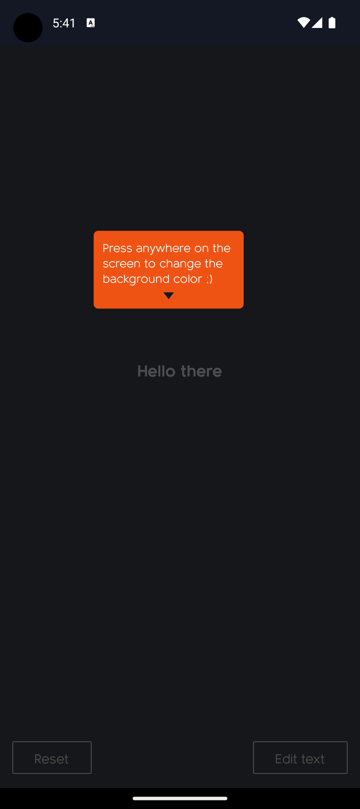
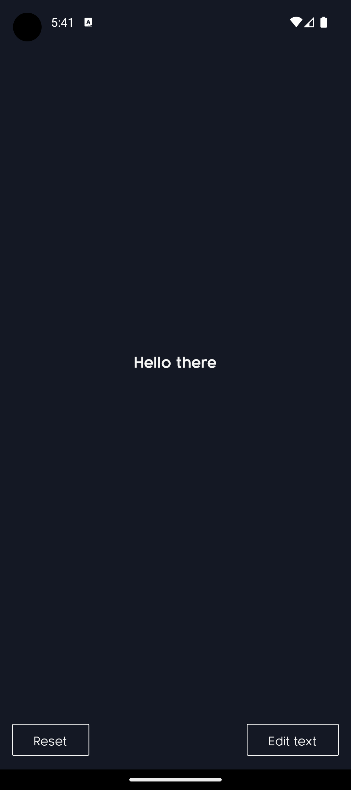
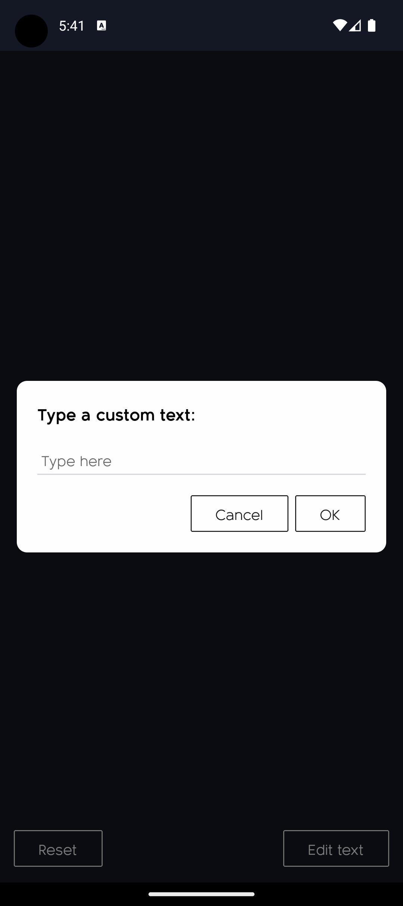
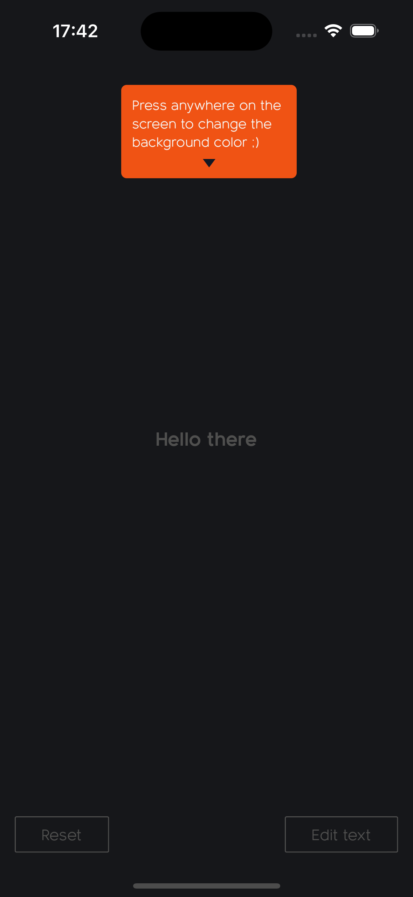
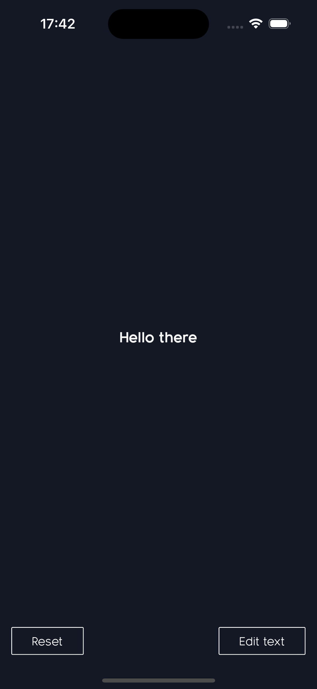
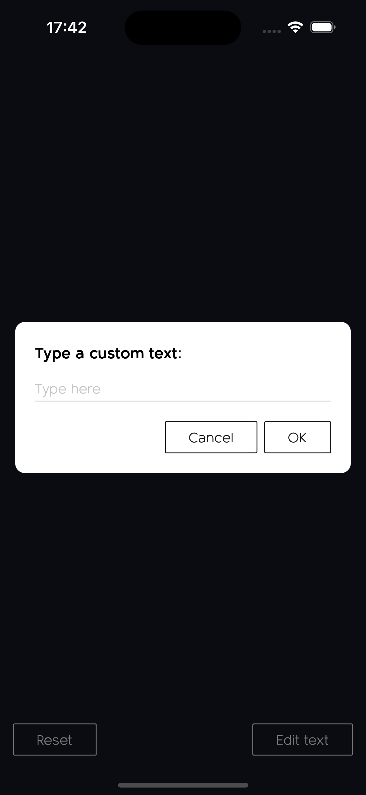

# Solid Software - Test App

This is a simple React Native application developed using **Expo**. The main purpose of the app is to demonstrate core functionality using clean UI, touch interaction, and dynamic background color handling.

## ✨ Features

- 📱 Displays the text `"Hello there"` centered on the screen.
- 🎨 Changes the background color to a random one on each tap anywhere on the screen.
- 🧠 Calculates the appropriate text color based on contrast.
- 💬 Editable text prompt: Tap "Edit text" to enter a custom message.
- ♻️ "Reset" button to reset to initial state.
- 💡 Tooltip shown on first app launch with guidance.

## ⚙️ Next steps
- 🧪 Unit tests using Jest for check the `handleGenerateRandomColor` function and the `contrastColor` value
- ✅ End-to-end (E2E) tests using Detox.

## 📦 Tech Stack

- [React Native](https://reactnative.dev/)
- [Expo](https://expo.dev/)
- [TypeScript](https://www.typescriptlang.org/)
- [NativeWind](https://www.nativewind.dev/) — Tailwind CSS in React Native
- [Async Storage](https://github.com/react-native-async-storage/async-storage/tree/main/packages/default-storage) — key-value storage system for React Native

## 🚀 Getting Started

Make sure you have Node.js and Expo CLI installed.

### 1. Clone the repository

```bash
git clone https://github.com/felipesilvadev/solid_software.git
```

### 2. Inside the folder's project, install the dependencies

```bash
cd solid_software
```

```bash
npm install
```

### 3. Then, open the app on your emulator or physical device using the Expo Go app or a simulator.

```bash
npm run ios || npm run android
```

## 📸 Screenshots

### 📱 Android

#### Tooltip



#### Home screen



#### Custom Modal Prompt



---

### 🍏 iOS

#### Tooltip



#### Home screen



#### Custom Modal Prompt



## 👨🏼‍💻 Author


**Felipe Carvalho**
[LinkedIn](https://www.linkedin.com/in/felipe-ss-carvalho/)